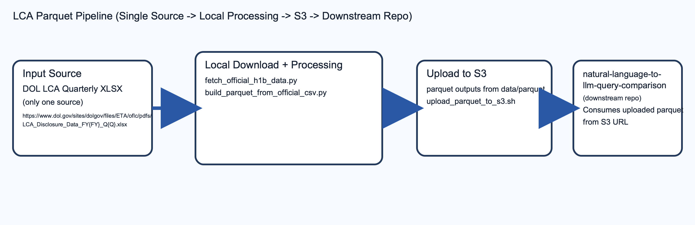

# H1B LCA Parquet Pipeline

Pipeline-only repository that downloads official H-1B LCA disclosures, normalizes them into CSV, builds parquet outputs, and uploads parquet to S3.

## What This Repo Does

- Downloads DOL LCA quarterly XLSX files.
- Normalizes DOL records into a combined CSV dataset.
- Builds both single-file parquet and year-partitioned parquet.
- Uploads parquet outputs to S3.

## Pipeline Diagram



## Prerequisites

- Python 3.10+
- AWS CLI configured (`aws configure`) for S3 operations
- Python packages: `openpyxl`, `pyarrow`

Install Python dependencies:

```bash
python3 -m pip install --user openpyxl pyarrow
```

## Quick Start

Run guidance:

> [!IMPORTANT]
> - **First time:** Run the full 3-args flow below. This downloads all quarters from FY2020, builds parquet, creates the S3 bucket, and uploads. The manifest is written automatically at the end — commit it.
> - **Incremental (2nd+ run, new quarters only):** Just run `npm run infra:up` again with the same args. The fetch script reads `data/manifest.json` and only downloads quarters newer than the last recorded one — no manual range args needed.
> - **Full rebuild from scratch (2nd+ run):** Reset the manifest, delete existing outputs, then run infra:up:
>   ```bash
>   echo '{"start_fy":2020,"start_quarter":1,"last_fy":2019,"last_quarter":4,"updated_at":"'$(date +%Y-%m-%d)'"}' > data/manifest.json
>   rm -f data/dol_lca_h1b_combined.csv && rm -rf data/parquet/
>   npm run infra:up -- [bucket-name] [aws-region] [version-tag]
>   ```
>   Commit the updated manifest after the run.

Build and upload parquet to S3:

```bash
npm run infra:up -- [bucket-name] [aws-region] [version-tag]
```

Example with all three values:

```bash
npm run infra:up -- h1b-lca-parquet-prod us-east-1 full_multi_fiscal_noempty_countrynull_$(date +%Y%m%d)
```

- If `bucket-name` is omitted, a unique bucket is created automatically.
- If `version-tag` is provided, cache-busted URLs are also printed.

Typical end-to-end runtime is about 20-25 minutes (depending on network and machine). Temporary XLSX and intermediate CSV files are removed automatically after each run.

## Commands

- Fetch and normalize official source data:

```bash
npm run fetch:official-data
```

- Build parquet from normalized CSV:

```bash
npm run build:parquet
```

- Upload parquet to S3:

```bash
npm run upload:s3:parquet -- <your-bucket-name> <aws-region> [version-tag]
```

Example with all three values:

```bash
npm run upload:s3:parquet -- h1b-lca-parquet-prod us-east-1 full_multi_fiscal_noempty_countrynull_$(date +%Y%m%d)
```

If `version-tag` is provided, the script also prints cache-busted URLs with `?v=<version-tag>`.

- End-to-end infra flow (fetch + parquet + bucket setup + upload):

```bash
npm run infra:up -- [bucket-name] [aws-region] [version-tag]
```

- Tear down infra bucket and objects:

```bash
npm run infra:down -- [bucket-name] [aws-region]
```

- Optional CloudFront in front of S3:

```bash
npm run create:cloudfront -- <your-bucket-name> <aws-region>
```

## Data Layout

The pipeline writes to `data/`:

- `data/manifest.json` — tracks the last successfully processed fiscal quarter; committed to git
- `data/dol_lca_h1b_combined.csv` — combined normalized CSV (gitignored; rebuilt on each run)
- `data/parquet/dol_lca_h1b_combined.parquet`
- `data/parquet/dol_lca_h1b_combined_partitioned/`

## Official Data Sources

- DOL LCA disclosure quarterly XLSX:
  `https://www.dol.gov/sites/dolgov/files/ETA/oflc/pdfs/LCA_Disclosure_Data_FY{FY}_Q{Q}.xlsx`

## Parallel Fetch/Normalize Tuning

Conservative defaults for older 16 GB Macs:

```bash
python3 scripts/fetch_official_h1b_data.py --parallel-downloads 4 --parallel-normalize 2
```

Example for faster ingest:

```bash
python3 scripts/fetch_official_h1b_data.py --parallel-downloads 6 --parallel-normalize 3
```
